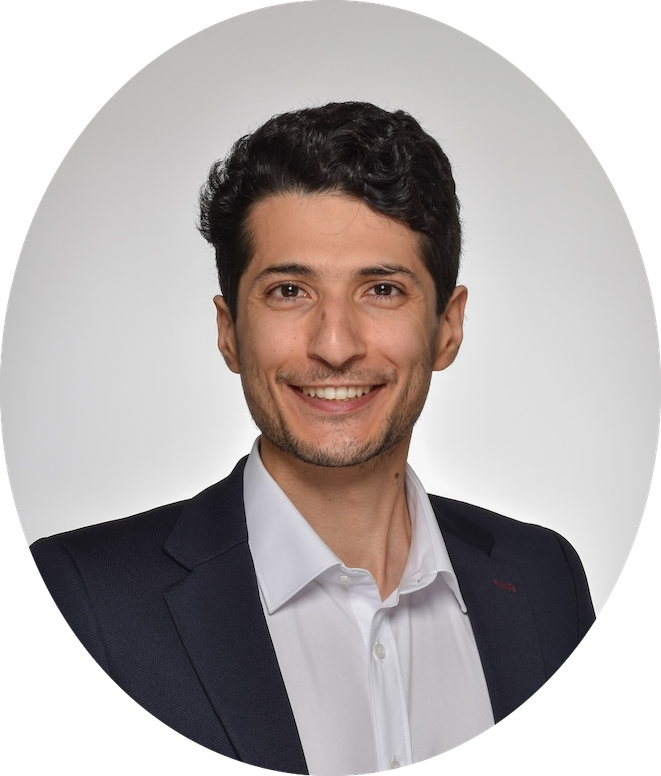
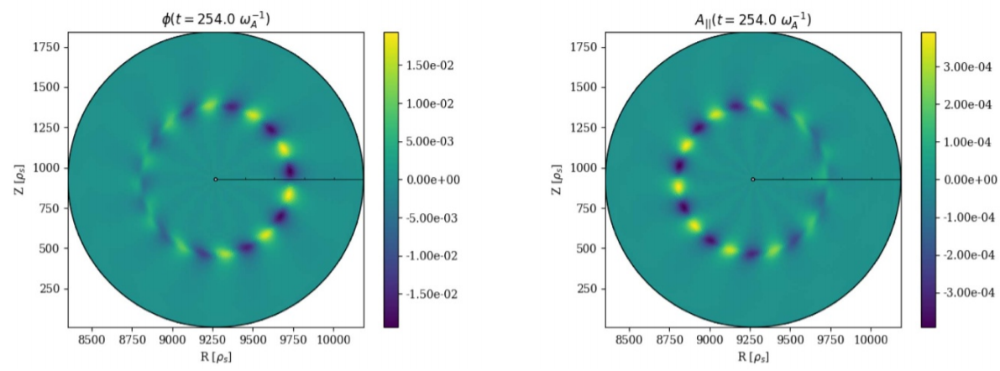
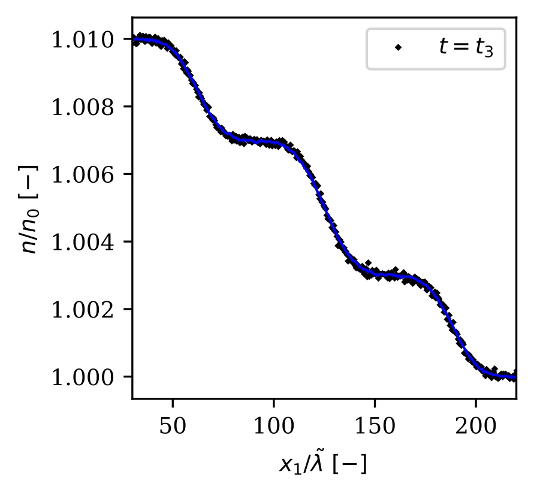
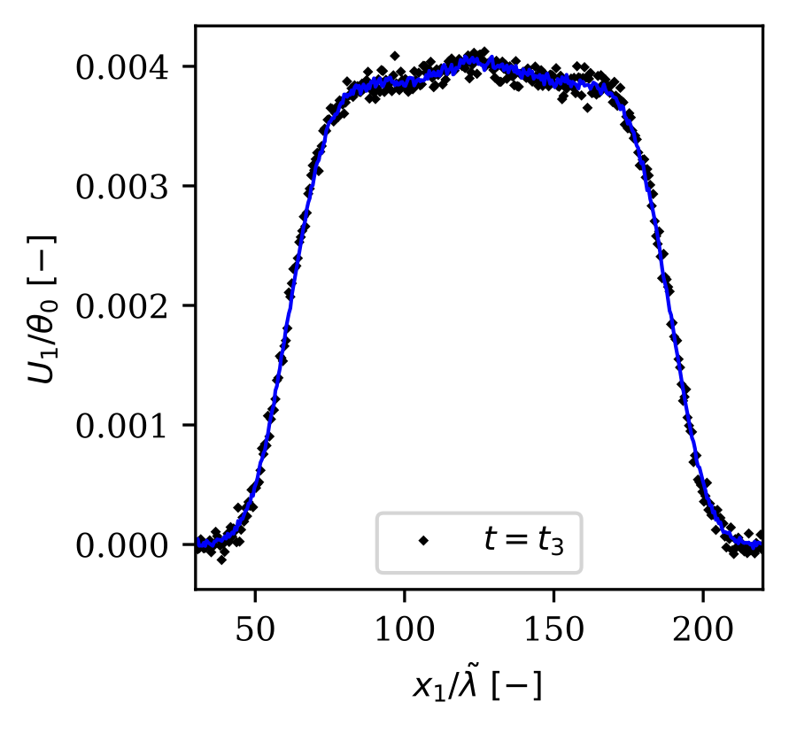
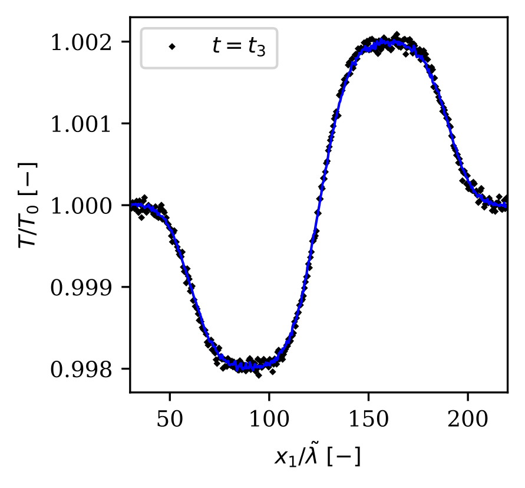
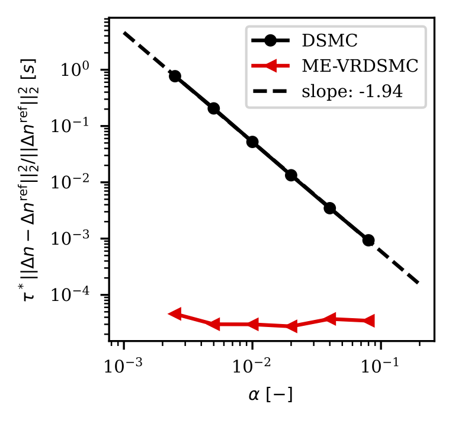

<html lang="en">
<head>
    <meta charset="UTF-8">
    <meta name="viewport" content="width=device-width, initial-scale=1.0">
    <title>Mohsen Sadr</title>

    
    

    <link rel="preconnect" href="https://fonts.googleapis.com">
    <link rel="preconnect" href="https://fonts.gstatic.com" crossorigin>
    <link href="https://fonts.googleapis.com/css2?family=Inter:wght@300;400;500;600;700&family=Source+Serif+4:ital,wght@0,400;0,600;1,400&display=swap" rel="stylesheet">
    <link href="https://fonts.googleapis.com/icon?family=Material+Icons" rel="stylesheet">

    
</head>
<body>

    <nav id="navbar">
        
        
        
        
        <a href="CV.pdf" download title="Download CV">
            description CV
        </a>
        
        <a href="#about">About</a>
        <a href="#news">News</a>
        <a href="#projects">Projects</a>
        <a href="#experience">Experience</a>
        <a href="#education">Education</a>
        <a href="#awards">Awards</a>
        <a href="#publications">Publications</a>
        <a href="#presentations">Talks</a>
        <a href="#teaching">Teaching</a>
        <a href="#referee">Review</a>
        <a href="#contact">Contact</a>
    </nav>

    

        
        <h1>Mohsen Sadr</h1>
        
Applied Mathematician &mdash; Statistical Modeling, Monte Carlo Methods, Optimal Transport &amp; Computational Physics

    

    

    <section id="about">
        <h2>About Me</h2>
        
I am an applied mathematician working at the intersection of computational physics, statistical modeling, and machine learning. My research spans Monte Carlo methods, density estimation, variance reduction, optimal transport, and particle methods, with applications in rarefied gas dynamics, plasma physics, and generative AI.

        
Currently, I am a Founder Fellow at the Paul Scherrer Institute (PSI) and a Research Affiliate at MIT. At PSI (2023&ndash;2025), I worked on optimal transport and collaborated with <strong>Dr. Andreas Adelmann</strong> on scaling <a href="https://github.com/OPALX-project/OPALX">OPALX</a>&mdash;a particle accelerator simulation library&mdash;for exascale HPC platforms. At MIT (2021&ndash;2023), I worked with <strong>Prof. Nicolas Hadjiconstantinou</strong> on general-purpose variance-reduced Monte Carlo methods for kinetic equations. Prior to that, I was a postdoc with <strong>Prof. Laurent Villard</strong> at the Swiss Plasma Center (EPFL), contributing to <a href="https://www.epfl.ch/research/domains/swiss-plasma-center/research/theory/codes/research_theory_codes_orb5/">ORB5</a>, a gyrokinetic particle-in-cell code for confined plasma simulations. I received my PhD in Applied Mathematics from RWTH Aachen University, advised by <strong>Prof. Manuel Torrilhon</strong> and <strong>Prof. Hossein Gorji</strong>, where my <a href="https://doi.org/10.18154/RWTH-2020-07249">dissertation</a> focused on efficient Monte Carlo methods for dense gas, liquid, and phase-transition kinetics.

    </section>

    <section id="news">
        <h2>News</h2>
        

            

                Feb
                2026
            

            

                <h3><a href="https://www.psi.ch/en/news/media-releases/psi-founder-fellowship-for-ai-platform-and-solid-state-batteries" target="_blank">PSI Founder Fellowship for AI Platform and Solid-State Batteries</a></h3>
                
Awarded a PSI Founder Fellowship (up to 150,000 CHF) to develop an AI-based platform that accelerates and reduces the cost of physical simulations for fusion energy, aerospace, and semiconductor technologies. The fellowship includes coaching and advisory services from PSI's technology transfer team and external experts.

                

                    <a href="https://www.psi.ch/en/news/media-releases/psi-founder-fellowship-for-ai-platform-and-solid-state-batteries" target="_blank">PSI Media Release</a>
                    &nbsp;&middot;&nbsp;
                    <a href="https://www.news.admin.ch/fr/newnsb/HKgkaTivg50VFiCnQbqXn" target="_blank">Swiss Federal Government</a>
                

            

        

        

            

                Oct
                2025
            

            

                <h3><a href="https://openreview.net/forum?id=Az3mJ4d1eT" target="_blank">Paper accepted in Transactions on Machine Learning Research (TMLR)</a></h3>
                
Our paper &ldquo;Data-Driven Discovery of PDEs via the Adjoint Method&rdquo; has been accepted in TMLR. We present an adjoint-based method for discovering governing PDEs from data, formulated as a PDE-constrained optimization problem with analytically derived gradients.

                

                    <a href="https://openreview.net/forum?id=Az3mJ4d1eT" target="_blank">OpenReview</a>
                    &nbsp;&middot;&nbsp;
                    <a href="https://github.com/mohsensadr/DiscoverPDEAdjoint" target="_blank">Code</a>
                

            

        

    </section>

    <section id="projects">
        <h2>Projects</h2>

        

            <h3>Non-equilibrium Multiphase Flows</h3>
            
In this line of research, I designed a stochastic process for modeling short and long-range interactions of monatomic particles that follows the exact kinetic equation up to desired moments with a feasible computational complexity that scales linearly with the number of particles. For details on the developed method, see [<a href="#FPmultiphase">7</a>, <a href="#LongRange">8</a>, <a href="#DFP">9</a>]. These methods have been implemented in a particle-in-cell code called <a href="https://github.com/piclas-framework/piclas">PICLas</a>. As a showcase, here a simulation of Argon's density experiencing the spinodal decomposition is presented.

            

                <iframe src="spinodal_4.mp4" frameborder="0" allowfullscreen></iframe>
            

        

        

            <h3>Excitation of Confined Plasma</h3>
            
Stabilizing a confined plasma in a fusion device is one of the main challenges in designing such a system. Often, it is worthwhile to study the growth/dissipation rates of modes of the system to better control the plasma. I have worked on excitation of Alfven modes in a confined plasma using a well-established particle-in-cell and gyrokinetic code called ORB5. As a showcase, electrostatic and magnetic potential fields are shown here where the mode of interest is successfully excited using a so-called antenna. For more details, see [<a href="#orb5">15</a>].

            
        

        

            <h3>Variance Reduction Method</h3>
            
One of the main challenges in interpreting the solution of statistical models is noise. I have developed a general-purpose and entropy-based variance reduction method for stochastic processes where the target density is around an equilibrium/control-variate density. In this project, I devised a consistent and least-biased evolution equation for the importance weights of the Boltzmann and Fokker-Planck equation. The following figures show the snapshot estimate of number density, bulk velocity, and temperature for the Sod-Shock tube test case. We also show how the noise varies with respect to the signal for the standard Monte Carlo and the introduced variance reduction method. For details, see [<a href="#VRPIC">4</a>], [<a href="#VRDSMC">5</a>] and [<a href="#VRFP">6</a>].

            

                
                
                
                
            

        

        

            <h3>Optimal Transport Problem</h3>
            
Finding the optimal map/plan between marginals is one of the most attractive problems in applied mathematics with applications in data-driven modeling and Machine Learning. I am interested in devising new dynamical systems to solve this problem more efficiently than standard methods. This includes collision-based dynamics [<a href="#colOT">1</a>], orthogonal coupling dynamics [<a href="#OCD">2</a>], and moment-based methods [<a href="#WE">3</a>]. As a showcase, here I show the output of a generative model trained using the optimal map between the normal and four other marginals.

            
        

    </section>

    <section id="experience">
        <h2>Experience</h2>
        <ul class="timeline">
            <li>
                
Founder Fellow

                
Paul Scherrer Institute (ETH-domain) &mdash; Scientific Computing, Theory and Data

                
February 2026 &ndash; present

            </li>
            <li>
                
Research Affiliate

                
Massachusetts Institute of Technology &mdash; Department of Mechanical Engineering

                
July 2025 &ndash; present

            </li>
            <li>
                
Scientist

                
Paul Scherrer Institute (ETH-domain) &mdash; Scientific Computing, Theory and Data

                
July 2023 &ndash; June 2025

            </li>
            <li>
                
Fellow

                
Massachusetts Institute of Technology &mdash; Department of Mechanical Engineering

                
December 2021 &ndash; June 2023

            </li>
            <li>
                
Scientific Collaborator

                
EPFL &mdash; Swiss Plasma Center

                
October 2020 &ndash; November 2021

            </li>
        </ul>
    </section>

    <section id="education">
        <h2>Education</h2>
        <ul class="timeline">
            <li>
                
PhD in Applied and Computational Mathematics

                
RWTH Aachen University, Germany

                
2020

            </li>
            <li>
                
MSc in Simulation Sciences

                
RWTH Aachen University, Germany

                
2017

            </li>
            <li>
                
BSc in Mechanical Engineering

                
KN Toosi University of Technology, Iran

                
2013

            </li>
        </ul>
    </section>

    <section id="awards">
        <h2>Awards &amp; Honors</h2>
        <ul>
            <li>100k CHF for Founder Fellowship grant from Paul Scherrer Institute and QBIT Capital in 2026.</li>
            <li>1.2m Euro for a project from EUROfusion and SNSF (consortium of national fusion research institutes) in 2021 (associated).</li>
            <li>100k Euro with national Walter Benjamin scholarship offered by German Research Foundation (DFG) in 2020.</li>
            <li>4k Euro travel grant from German Academic Exchange Service (DAAD) in 2019.</li>
        </ul>
    </section>

    <section id="publications">
        <h2>Publications</h2>

        
Optimal Transport

        <ul>
            <li id="colOT">
                1. Mohsen Sadr and M. Hossein Gorji. &ldquo;Collision-based dynamics for multi-marginal optimal transport&rdquo; 2024
                [<a href="https://doi.org/10.48550/arXiv.2412.16385">Preprint</a> | <a href="https://github.com/mohsensadr/collisional_ot">Code</a>]
            </li>
            <li id="OCD">
                2. Mohsen Sadr, Peyman Mohajerin Esfehani, and M. Hossein Gorji. &ldquo;Optimal transportation by orthogonal coupling dynamics&rdquo; 2024
                [<a href="https://doi.org/10.48550/arXiv.2410.08060">Preprint</a> | <a href="https://github.com/mohsensadr/OCD">Code</a>]
            </li>
            <li id="WE">
                3. Mohsen Sadr, Nicolas G. Hadjiconstantinou, and M. Hossein Gorji. &ldquo;Wasserstein-penalized Entropy closure: A use case for stochastic particle methods&rdquo; <em>Journal of Computational Physics</em>, 2024
                [<a href="https://doi.org/10.1016/j.jcp.2024.113066">Elsevier</a> | <a href="https://arxiv.org/abs/2306.04120">Preprint</a> | <a href="https://github.com/mohsensadr/WE">Code</a>]
            </li>
        </ul>

        
Variance Reduction

        <ul>
            <li id="VRPIC">
                4. Victor Windhab, Andreas Adelmann, Mohsen Sadr. &ldquo;VR-PIC: An entropic variance-reduction method for particle-in-cell solutions of the Vlasov-Poisson equation&rdquo; 2026
                [<a href="https://doi.org/10.48550/arXiv.2602.15041">Preprint</a> | <a href="https://github.com/mohsensadr/VRPIC">Code</a>]
            </li>
            <li id="VRDSMC">
                5. Mohsen Sadr, and Nicolas G. Hadjiconstantinou. &ldquo;A variance-reduced direct Monte Carlo simulation method for solving the Boltzmann equation over a wide range of rarefaction&rdquo; <em>Journal of Computational Physics</em>, 472, 111677, 2023
                [<a href="https://doi.org/10.1016/j.jcp.2022.111677">Elsevier</a> | <a href="https://papers.ssrn.com/sol3/papers.cfm?abstract_id=4148310">Preprint</a>]
            </li>
            <li id="VRFP">
                6. Mohsen Sadr, and Nicolas G. Hadjiconstantinou. &ldquo;Variance reduced particle solution of the Fokker-Planck equation with application to rarefied gas and plasma dynamics&rdquo; <em>Journal of Computational Physics</em>, 492, 112402, 2023
                [<a href="https://doi.org/10.1016/j.jcp.2023.112402">Elsevier</a> | <a href="https://dx.doi.org/10.2139/ssrn.4353547">Preprint</a>]
            </li>
        </ul>

        
Modelling in Kinetic Theory

        <ul>
            <li id="FPmultiphase">
                7. Mohsen Sadr, Marcel Pfeiffer, and M. Hossein Gorji. &ldquo;Fokker-Planck-Poisson kinetics: multi-phase flow beyond equilibrium&rdquo; <em>Journal of Fluid Mechanics</em>, 920, A46, 2021
                [<a href="https://doi.org/10.1017/jfm.2021.461">Cambridge University Press</a> | <a href="https://arxiv.org/abs/2308.05580">Preprint</a>]
            </li>
            <li id="LongRange">
                8. Mohsen Sadr, and M. Hossein Gorji. &ldquo;Treatment of long-range interactions arising in the Enskog&ndash;Vlasov description of dense fluids&rdquo; <em>Journal of Computational Physics</em>, 378, 129&ndash;142, 2019
                [<a href="https://doi.org/10.1016/j.jcp.2018.11.005">Elsevier</a> | <a href="https://arxiv.org/abs/2308.05845">Preprint</a> | <a href="https://github.com/mohsensadr/Monte-Carlo-Particle-Method">Code</a>]
            </li>
            <li id="DFP">
                9. Mohsen Sadr, and M. Hossein Gorji. &ldquo;A continuous stochastic model for non-equilibrium dense gases&rdquo; <em>Journal of Physics of Fluids</em>, 29, 122007, 2017
                [<a href="https://doi.org/10.1063/1.5004409">American Institute of Physics</a> | <a href="https://arxiv.org/abs/2308.05117">Preprint</a> | <a href="https://github.com/mohsensadr/Monte-Carlo-Particle-Method">Code</a>]
            </li>
        </ul>

        
Data-Driven Modelling

        <ul>
            <li>
                10. Mohsen Sadr, Tony Tohme, and Kamal Youcef-Toumi. &ldquo;Data-driven discovery of PDEs via the adjoint method&rdquo; <em>Transactions on Machine Learning Research</em>, 2025
                [<a href="https://openreview.net/forum?id=Az3mJ4d1eT">OpenReview</a> | <a href="https://github.com/mohsensadr/DiscoverPDEAdjoint">Code</a>]
            </li>
            <li>
                11. Tony Tohme, Mohsen Sadr, Kamal Youcef-Toumi, and Nicolas G. Hadjiconstantinou. &ldquo;MESSY Estimation: Maximum-Entropy based Stochastic and Symbolic densitY Estimation&rdquo; <em>Transactions on Machine Learning Research</em>, 2023
                [<a href="https://openreview.net/forum?id=Y2ru0LuQeS">OpenReview</a> | <a href="https://github.com/mohsensadr/MESSY">Code</a>]
            </li>
            <li>
                12. Mohsen Sadr, Manuel Torrilhon, and M. Hossein Gorji. &ldquo;Gaussian Process Regression for Maximum Entropy Distribution&rdquo; <em>Journal of Computational Physics</em>, 418, 109644, 2020
                [<a href="https://doi.org/10.1016/j.jcp.2020.109644">Elsevier</a> | <a href="https://arxiv.org/abs/2308.06149">Preprint</a>]
            </li>
        </ul>

        
Approximating Collision Operator

        <ul>
            <li>
                13. Fabian Mies, Mohsen Sadr, and Manuel Torrilhon. &ldquo;An efficient jump-diffusion approximation of the Boltzmann equation&rdquo; <em>Journal of Computational Physics</em>, 490, 112308, 2023
                [<a href="https://doi.org/10.1016/j.jcp.2023.112308">Elsevier</a> | <a href="https://arxiv.org/abs/2112.08362">Preprint</a>]
            </li>
            <li>
                14. Mohsen Sadr, Qian Wang, and M. Hossein Gorji. &ldquo;Coupling kinetic and continuum using data-driven maximum entropy distribution&rdquo; <em>Journal of Computational Physics</em>, 444, 110542, 2021
                [<a href="https://doi.org/10.1016/j.jcp.2021.110542">Elsevier</a> | <a href="https://arxiv.org/abs/2308.05672">Preprint</a>]
            </li>
        </ul>

        
Simulation of Plasma / Fluid

        <ul>
            <li id="orb5">
                15. Mohsen Sadr, Alexey Mishchenko, Thomas Hayward-Schneider, Axel Koenies, Alberto Bottino, Alessandro Biancalani, Peter Donnel, Emmanuel Lanti, and Laurent Villard. &ldquo;Linear and nonlinear excitation of TAE modes by external electromagnetic perturbations using ORB5&rdquo; <em>Plasma Physics and Controlled Fusion</em>, 64, 085010, 2022
                [<a href="https://iopscience.iop.org/article/10.1088/1361-6587/ac73eb">IOP Publishing (open access)</a>]
            </li>
            <li>
                16. P Donnel, J Cazabonne, L Villard, S Brunner, S Coda, J Decker, M Murugappan, and M Sadr. &ldquo;Quasilinear treatment of wave&ndash;particle interactions in the electron cyclotron range and its implementation in a gyrokinetic code&rdquo; <em>Plasma Physics and Controlled Fusion</em>, 63, 064001, 2021
                [<a href="https://iopscience.iop.org/article/10.1088/1361-6587/abf53f">IOP Publishing (open access)</a>]
            </li>
            <li>
                17. Sima Farazi, Mohsen Sadr, Seongwon Kang, Martin Schiemann, Nikita Vorobiev, Viktor Scherer, Heinz Pitsch. &ldquo;Resolved simulations of single char particle combustion in a laminar flow field&rdquo; <em>Fuel</em>, 201, 15&ndash;28, 2017
                [<a href="https://doi.org/10.1016/j.fuel.2016.11.011">Elsevier</a>]
            </li>
        </ul>
    </section>

    <section id="presentations">
        <h2>Presentations</h2>

        <h3>Conferences</h3>
        <ul>
            <li>Particles, Flows &amp; Maps for Sampling Complex Distributions, Lausanne, Switzerland, November 2025 <a href="presentations/EPFL_Poster_2025_Collisional_OT.pdf" target="_blank" class="badge badge-poster">poster</a></li>
            <li>5th Mathematical and Scientific Machine Learning, Naples, Italy, August 2025 <a href="presentations/MSML2025_Naples_poster.pdf" target="_blank" class="badge badge-poster">poster</a></li>
            <li>30th Biennial Numerical Analysis Conference, Glasgow, UK, June 2025 <a href="presentations/30th_Biennial_Numerical_Analysis_Conference_talk.pdf" target="_blank" class="badge badge-talk">talk</a></li>
            <li>4th Mathematical and Scientific Machine Learning, Providence, USA, June 2023 <a href="presentations/MLML2023_ICERM_poster.pdf" target="_blank" class="badge badge-poster">poster</a></li>
            <li>19th European Fusion Theory Conference, virtual, October 2021 <a href="presentations/EFTC_antenna_poster.pdf" target="_blank" class="badge badge-poster">poster</a></li>
            <li>9th International Congress on Industrial and Applied Mathematics, Valencia, Spain, July 2019 <a href="presentations/ICIAM_poster.pdf" target="_blank" class="badge badge-poster">poster</a></li>
            <li>10th International Conference on Multiphase Flow, Rio de Janeiro, Brazil, May 2019 <a href="presentations/MultiphaseFlows_talk.pdf" target="_blank" class="badge badge-talk">talk</a></li>
            <li>3rd European Conference on Non-Equilibrium Gas Flows, Strasbourg, France, February 2018 <a href="presentations/NEGF_2018_talk.pdf" target="_blank" class="badge badge-talk">talk</a></li>
        </ul>

        <h3>Invited Talks</h3>
        <ul>
            <li>Swiss Plasma Center, EPFL, April 2025</li>
            <li>PSI, CSD Scientific Retreat, March 2024</li>
            <li>PSI, Machine Learning Seminar Series, April 2024</li>
            <li>MIT, Symposium of Center for Computational Science &amp; Technology, March 2023</li>
            <li>Swiss Plasma Center, EPFL, April 2020</li>
            <li>EPFL, Mathematics Institute of Computational Science and Engineering (MATHICSE), July 2019</li>
            <li>ETH Zurich, Institute of Fluid Dynamics, May 2018</li>
            <li>ETH Zurich, Institute of Fluid Dynamics, August 2017</li>
        </ul>
    </section>

    <section id="teaching">
        <h2>Teaching</h2>

        <h3>ETH Zurich</h3>
        <ul>
            <li>Introduction to Computational Physics: Monte Carlo methods (2023 and 2024) <a href="teaching_slides/ICP.pdf" target="_blank">[slides]</a></li>
            <li>Computational Statistical Physics: rarefied gas and plasma dynamics (2024) <a href="teaching_slides/CSP.pdf" target="_blank">[slides]</a></li>
        </ul>

        <h3>EPFL</h3>
        <ul>
            <li>Computational Physics 1 and 2: advection-diffusion equation, nonlinear dynamics, chaotic systems (2020 and 2021)</li>
        </ul>

        <h3>RWTH Aachen</h3>
        <ul>
            <li>Mathematical Foundations 1&ndash;5: numerical methods for PDEs, iterative solvers, Fourier transformation, linear algebra (2017 to 2019)</li>
        </ul>
    </section>

    <section id="referee">
        <h2>Review</h2>
        
I am an active referee of the following peer-reviewed journals and conferences:

        <ul>
            <li><a href="https://www.sciencedirect.com/journal/journal-of-computational-physics">Journal of Computational Physics</a></li>
            <li><a href="https://pubs.aip.org/aip/pof">Physics of Fluids</a></li>
            <li><a href="https://www.nature.com/srep/">Nature: Scientific Reports</a></li>
            <li><a href="https://www.sciencedirect.com/journal/computer-physics-communications">Computer Physics Communications</a></li>
            <li><a href="https://www.sciencedirect.com/journal/communications-in-nonlinear-science-and-numerical-simulation">Comm. in Nonlinear Science &amp; Numerical Simulation</a></li>
            <li><a href="https://iclr.cc">ICLR</a></li>
            <li><a href="https://www.mdpi.com/journal/applsci">Applied Sciences</a></li>
            <li><a href="https://link.springer.com/journal/11012">Meccanica</a></li>
            <li><a href="https://www.sciencedirect.com/journal/advanced-powder-technology">Advanced Powder Technology</a></li>
            <li><a href="https://www.mdpi.com/journal/photonics">Photonics</a></li>
        </ul>
    </section>

    <section id="contact">
        <h2>Contact</h2>
        
You can reach me at <a href="mailto:mohsen.sadr@icloud.com">mohsen.sadr@icloud.com</a>

    </section>

    

    <footer>
        &copy; 2026 Mohsen Sadr. All rights reserved.
    </footer>

    

    

</body>
</html>
