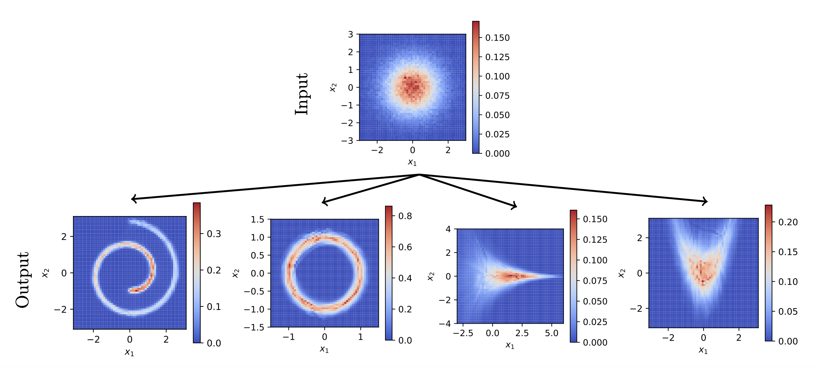

<html lang="en">
<head>
    <meta charset="UTF-8">
    <meta name="viewport" content="width=device-width, initial-scale=1.0">
    <title>Mohsen Sadr - Welcome</title>
    <!-- MathJax Configuration -->
    

    <!-- MathJax Script -->
    

    <link rel="stylesheet" href="https://cdnjs.cloudflare.com/ajax/libs/KaTeX/0.13.13/katex.min.css">
    

    
</head>
<body>

<header>
    <link href="https://fonts.googleapis.com/icon?family=Material+Icons" rel="stylesheet">
</header>

    <nav>
        <a href="CV.pdf" download>
            description
            CV
        </a>
        <a href="https://github.com/mohsensadr" target="_blank" title="GitHub">
             GitHub
        </a>
        <a href="#about">About Me</a>
        <a href="#projects">Projects</a>
        <a href="#experience">Experience</a>
        <a href="#education">Education</a>
        <a href="#publications">Publications</a>
        <a href="#referee">Review Contribution</a>
        <a href="#contact">Contact</a>
    </nav>

    <section id="about">
        <h2>About Me</h2>
        

            My name is Mohsen. Currently, I am working on optimal transport problem as a researcher at the <a href="https://www.psi.ch/en">Paul Scherrer Institute</a>, Switzerland, since July of 2023. Here, I am also involved in upgrading <a href="https://gitlab.psi.ch/OPAL">OPAL</a>  (Object Oriented Particle Accelerator Library) to be exa-scalable and portable for simulating particle accelerators, plasma, and rarefied gas dynamics. In Dec. 2021, I joined <a href="https://www.mit.edu">MIT</a>, USA, and worked with Prof. Nicolas Hadjiconstantinou on developing a general-purpose variance reduction for Monte Carlo methods in kinetic theory. Before that, I worked with Prof. Laurent Villard at the <a href="https://www.epfl.ch/research/domains/swiss-plasma-center/">Swiss Plasma Center</a>, Switzerland, as a postdoc on a particle-in-cell code for simulating plasma in confined geometry called <a href="https://www.epfl.ch/research/domains/swiss-plasma-center/research/theory/codes/research_theory_codes_orb5/">ORB5</a>. I carried out my doctoral studies at RWTH Aachen University, Germany, under the supervision of Prof. Manuel Torrilhon and Dr. Hossein Gorji. My dissertation was about developing efficient Monte Carlo methods for simulating dense gas, liquid, and phase transition in kinetic theory.
        

        
    </section>

<section id="projects">
    <h2>Projects</h2>
    
    <h3>Optimal Transport</h3>
    
    
 Finding the optimal map/plan between marginals are one of the most attractive problems in applied mathematics with application in data-driven modelling and Machine Learning. I am very much interested in devising new dynamical systems to solve this problem more efficiently than standard methods. This includes collision-based dynamics [<a href="#colOT">1</a>], orthogonal coupling dynamics [<a href="#OCD">2</a>], moment-based methods [<a href="#WE">3</a>]. As a showcase, here we show the ouptut of generative model learned using the optimal map between normal and 4 other marginals. 

     
     
     
    <h3>Variance Reduction</h3>

One of the main challenges in interpreting solution to statistical models is noise in prediction. We have developed a general-pupose varince reduction method for sotchastic processes where the target density is around an equilibrium/control-variate denisty. In this project, we devised a consistent and least-biased evolution equation for the importance weights for Boltzmann collision operator as well as a general Fokker-Planck type equation. The following figures show the snapshot estimate of number density, bulk velocity, and temperature for the Sod-Shock tube test case. We also show how the noise varies with respect to the signal for the standard Monte Carlo and the introduced variance reduction method. For details, see [<a href="#VRDSMC">4</a>] and [<a href="#VRFP">5</a>]. 

    <h3>Phase Transition</h3>
    
    
 In this line of research, we designed a stochastic process for modelling the phase transition of monatomic particle that follows the exact kinetic equation up in distribution up to desired moments with the computational complexity that is linear with number of particles. For details on the developed method, see [<a href="#FPmultiphase">6</a>, <a href="#LongRange">7</a>, <a href="#DFP">8</a>]. As a showcase, here we present a simulation of Argon's density going through the spinodal decomposition. 

    <iframe src="spinodal_4.mp4" frameborder="0" allowfullscreen></iframe>

</section>

<section id="experiance">
    <h2>Experience</h2>
    <h3>Postdoc at <a href="https://www.psi.ch/en">Paul Scherrer Institute</a></h3>
    
Scientific Computing, Theory and Data

    
Switzerland, Jul. 2023 - present.

    
    <h3>Postdoc at <a href="https://www.mit.edu">Massachusetts Institute of Technology</a> </h3>
    
Department of Mechanical Engineering

    
USA, Dec. 2021 - Jun. 2023.

    <h3>Postdoc at <a href="https://www.epfl.ch/en/">EPFL</a> </h3>
    
<a href="https://www.epfl.ch/research/domains/swiss-plasma-center/">Swiss Plasma Center</a>

    
Switzerland, Oct. 2020 - Nov. 2021.

</section>

<section id="education">
    <h2>Education</h2>
    <h3>Ph.D. in Applied and Computational Mathematics</h3>
    
RWTH Aachen University, Germany, 2020.

    
    <h3>Master's in Simulation Sciences</h3>
    
RWTH Aachen University, Germany, 2017.

</section>

<section id="publications">
    <h2>Publications</h2>
    <ul>

        <strong>Optimal Transport:</strong>

        <li id="colOT">
        1. Mohsen Sadr and Hossein Gorji. "Collision-based dynamics for multi-marginal optimal transport". 2024 [<a href="https://doi.org/10.48550/arXiv.2412.16385">Preprint</a> | <a href="https://github.com/mohsensadr/collisional_ot">Code</a>].
        </li>

        <li id="OCD">
        2. Mohsen Sadr, Peyman Mohajerin Esfehani, and M. Hossein Gorji. "Optimal transportation by orthogonal
coupling dynamics". 2024. [<a href="https://doi.org/10.48550/arXiv.2410.08060">Preprint</a>].
        </li>

         <li id="WE">
        3. Mohsen Sadr, Nicolas G. Hadjiconstantinou, and M. Hossein Gorji. "Wasserstein-penalized Entropy closure: A use case for stochastic particle methods" <em>Journal of Computational Physics </em>, 2024 [<a href="https://doi.org/10.1016/j.jcp.2024.113066">Elsevier</a> | <a href="https://arxiv.org/abs/2306.04120">Preprint</a>].
        </li>
        
        <strong>Variance Reduction:</strong>
        
        <li id="VRDSMC">
        4. Mohsen Sadr, and Nicolas G. Hadjiconstantinou. "A variance-reduced direct Monte Carlo simulation method for solving the Boltzmann equation over a wide range of rarefaction" <em>Journal of Computational Physics</em>, 472, 111677, 2023 [<a href="https://doi.org/10.1016/j.jcp.2022.111677">Elsevier</a> | <a href="https://papers.ssrn.com/sol3/papers.cfm?abstract_id=4148310">Preprint</a>].
        </li>

        <li id="VRFP">
        5. Mohsen Sadr, and Nicolas G. Hadjiconstantinou. "Variance reduced particle solution of the Fokker-Planck equation with application to rarefied gas and plasma dynamics" <em>Journal of Computational Physics</em>, 492, 112402, 2023 [<a href="https://doi.org/10.1016/j.jcp.2023.112402">Elsevier</a> | <a href="https://dx.doi.org/10.2139/ssrn.4353547">Preprint</a>].
        </li>

        <strong>Modelling Phase Transition:</strong>
        
        <li id="FPmultiphase">
        6. Mohsen Sadr, Marcel Pfeiffer, and M. Hossein Gorji. "Fokker-Planck-Poisson kinetics: multi-phase flow beyond equilibrium" <em>Journal of Fluid Mechanics</em>, 920, A46, 2021 [<a href="https://doi.org/10.1017/jfm.2021.461">Cambridge University Press</a> | <a href="https://arxiv.org/abs/2308.05580">Preprint</a>].
        </li>

        <li id="LongRange">
        7. Mohsen Sadr, and M. Hossein Gorji. "Treatment of long-range interactions arising in the Enskog–Vlasov description of dense fluids" <em>Journal of Computational Physics</em>, 378, 129-142, 2019 [<a href="https://doi.org/10.1016/j.jcp.2018.11.005">Elsevier</a> | <a href="https://arxiv.org/abs/2308.05845">Preprint</a>].
        </li>

        <li id="DFP">
        8. Mohsen Sadr, and M. Hossein Gorji. "A continuous stochastic model for non-equilibrium dense gases" <em>Journal of Physics of Fluids</em>, 29, 122007, 2017 [<a href="https://doi.org/10.1063/1.5004409">American Institute of Physics</a> | <a href="https://arxiv.org/abs/2308.05117">Preprint</a>].
        </li>
        
        <strong>Density Estimation:</strong>

        <li>
        9. Tony Tohme, Mohsen Sadr, Kamal Youcef-Toumi, and Nicolas G. Hadjiconstantinou. "MESSY Estimation: Maximum-Entropy based Stochastic and Symbolic densitY Estimation" <em>Transactions on Machine Learning Research </em>, 2023 [<a href="https://arxiv.org/abs/2306.04120">Preprint</a>].
        </li>

        <li>
        10. Mohsen Sadr,  Manuel Torrilhon, and M. Hossein Gorji. "Gaussian Process Regression for Maximum Entropy Distribution" <em>Journal of Computational Physics</em>, 418, 109644, 2020 [<a href="https://doi.org/10.1016/j.jcp.2020.109644">Elsevier</a> | <a href="https://arxiv.org/abs/2308.06149">Preprint</a>].
        </li>

        <strong>Approximating Collision Operator:</strong>

        <li>
        11. Fabian Mies, Mohsen Sadr, and Manuel Torrilhon. "An efficient jump-diffusion approximation of the Boltzmann equation" <em>Journal of Computational Physics</em>, 490, 112308, 2023 [<a href="https://doi.org/10.1016/j.jcp.2023.112308">Elsevier</a> | <a href="https://arxiv.org/abs/2112.08362">Preprint</a>].
        </li>

        <li>
        12. Mohsen Sadr, Qian Wang, and M. Hossein Gorji. "Coupling kinetic and continuum using data-driven maximum entropy distribution" <em>Journal of Computational Physics</em>, 444, 110542, 2021 [<a href="https://doi.org/10.1016/j.jcp.2021.110542">Elsevier</a> | <a href="https://arxiv.org/abs/2308.05672">Preprint</a>].
        </li>

        <strong>Simulation of Plasma/Fluid:</strong>
        
        <li>
        13. Mohsen Sadr, Alexey Mishchenko, Thomas Hayward-Schneider, Axel Koenies, Alberto Bottino, Alessandro Biancalani, Peter Donnel, Emmanuel Lanti, and Laurent Villard. "Linear and nonlinear excitation of TAE modes by external electromagnetic perturbations using ORB5" <em>Plasma Physics and Controlled Fusion</em>, 64, 085010, 2022 [<a href="https://iopscience.iop.org/article/10.1088/1361-6587/ac73eb">IOP Publishing Ltd (open access)</a>].
        </li>

        <li>
        14. P Donnel, J Cazabonne, L Villard, S Brunner, S Coda, J Decker, M Murugappan, and M Sadr. "Quasilinear treatment of wave–particle interactions in the electron cyclotron range and its implementation in a gyrokinetic code" <em>Plasma Physics and Controlled Fusion</em>, 63, 064001, 2021 [<a href="https://iopscience.iop.org/article/10.1088/1361-6587/abf53f">IOP Publishing Ltd (open access)</a>].
        </li>
        
        <li>
        15. Sima Farazi, Mohsen Sadr, Seongwon Kang, Martin Schiemann, Nikita Vorobiev, Viktor Scherer, Heinz Pitsch. "Resolved simulations of single char particle combustion in a laminar flow field" <em>Fuel</em>, 201, 15-28, 2017 [<a href="https://doi.org/10.1016/j.fuel.2016.11.011">Elsevier</a>].
        </li>
        
        
    </ul>
</section>

<section id="referee">
        <h2>Review Contribution</h2>

        

        I am an active referee of the following peer-reviewed journals/conferences:
        

        
        <li>
             <a href="https://www.sciencedirect.com/journal/journal-of-computational-physics">Journal of Computational Physics</a>
        </li>

        <li>
             <a href="https://pubs.aip.org/aip/pof?gad_source=1&gbraid=0AAAAADgwGbzh-SiC9i39ahsUKgozB8sDJ&gclid=Cj0KCQjw1Yy5BhD-ARIsAI0RbXaaBDmB03R1ixhcDVy_1zWYKVKB8Ik_sG-5GmENfxe75-kplx7P0z8aAgYUEALw_wcB">Physics of Fluids (POF)</a>
        </li>

        <li>
             <a href="https://iclr.cc">International Conference on Learning Representations (ICLR)</a>
        </li>
        
        <li>
             <a href="https://link.springer.com/journal/11012">Meccanica</a>
        </li>
        
        <li>
            <a href="https://www.mdpi.com/journal/photonics">Photonics</a>
        </li>
    </section>
    
    <section id="contact">
        <h2>Contact</h2>
        

            You can reach me at <a href="mailto:mohsen.sadr@psi.ch">mohsen.sadr@psi.ch</a> or <a href="mailto:mohsen.sadr91@gmail.com">mohsen.sadr91@gmail.com</a>.
        

    </section>

    <footer>
        &copy; 2024 Mohsen Sadr. All rights reserved.
    </footer>

</body>
</html>
